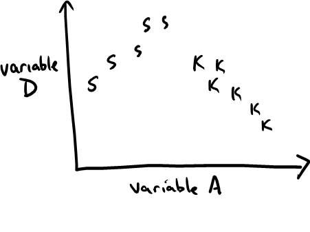
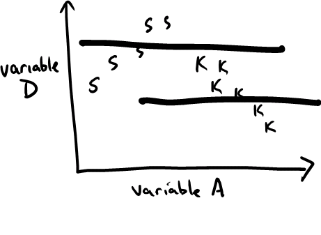
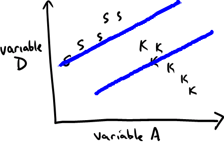
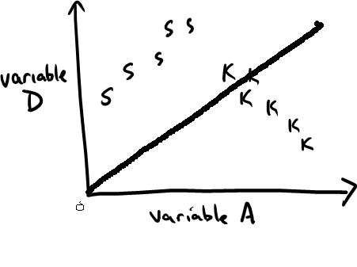
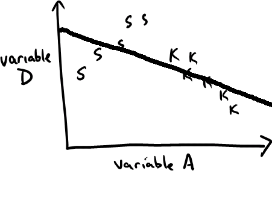
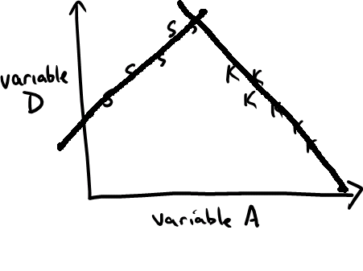
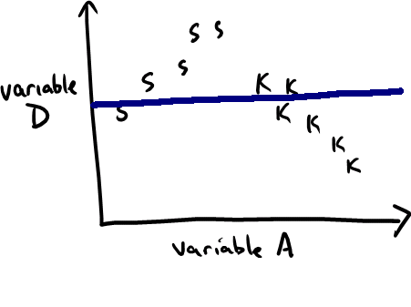
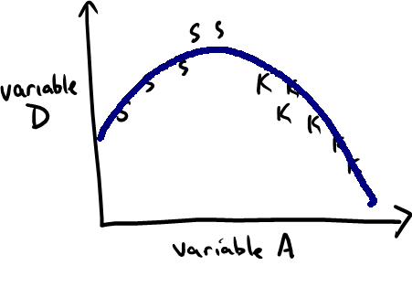

<!--  Author: Kaplan -->
<!--  Subject: Model structures, graphs of models -->

The drawings show some data involving three variables: 
<!-- begin itemize -->

#. D --- a quantitative variable
#. A --- a quantitative variable
#. G --- a categorical variable with two levels: S TEX COMMAND NOT FOUND    K
<!-- end itemize -->



Copy the above graph onto a piece of paper.  On top of that sketch, you will be drawing functions specified by model formulas.  For example:

Example: D ~ G.




Draw a function that shows the pattern of the fitted model values for each of the following models:


a. D ~ A + G
    
    ```{asis}
 

There are two linear components --- one for each level of G.  But, since there is no interaction term, the lines must have the same slope. 
```
#. D ~ A-1
    
    ```{asis}
  

The exclusion of the intercept term forces the line to go through the origin.
```
#. D ~ A
    
    ```{asis}
  

A simple straight-line graph.
```

#. D ~ A*G
    
    ```{asis}


By including an interaction term between A and G, the lines for each group can have different slopes.
```
#. D ~ 1
    
    ```{asis} 
 

This is the all-cases-the-same model.  Since model doesn't depend on A or G at all, the graph is flat.
```
#. D ~ poly(A,2)
    
    ```{asis}
 

A second-order polynomial has a parabolic shape.  The fitted parameters set the location of the peak and the orientation ("bowl" or "mountain").
```


